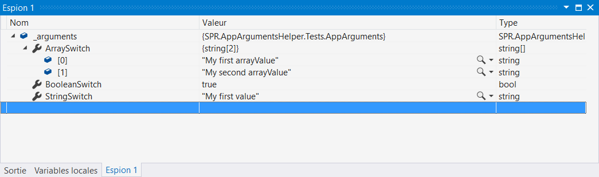

### What is SPR.AppArgumentsHelper ?

This library aims to help developers handling the command-line arguments that may be passed to their apps. It maps the command-line `params string[] args` to a user-defined type using attribute metadata.

`ApplicationMapper<T>.LoadArgs(string[] args)` is the entry point to handle the process of creating a usable object from a complex string array. Its generic parameter type is the user-defined type to use as a destination for the data. The layout of this type must respect the following rules :
* The destination members for the data gathered in the command line args must be **public, non-static properties**.
* Each one of these properties have to be decorated with an `ArgumentSwitchAttribute` which describes the associated command line switch.

### Example

We have an application that should be started with the following command :
  > MyApp.exe --stringSwitch "My first value" --booleanSwitch --arraySwitch "My first arrayValue" --arraySwitch "My second arrayValue" 
    
Let's also say `stringSwitch` is a required switch, so the app should throw an Exception when it isn't provided.
With this library, the major part of the work is properly defining a type to contains the provided values. 

    internal class AppArguments
    {
        [ArgumentSwitch("stringSwitch", ArgumentMode.Required)]
        public string StringSwitch { get; set; }

        [ArgumentSwitch("booleanSwitch")]
        public bool BooleanSwitch { get; set; }

        [ArgumentSwitch("arraySwitch", ArgumentMode.Optional)]
        public string[] ArraySwitch { get; set; }
    }

What have we done here ?
* For the `--stringSwitch` switch, we have defined a `string` property. The attribute links the switch and the property through its first parameter. To define the switch as required, we used the second parameter of the attribute. If the switch is not used in the command line, an `ArgumentException` is thrown.
* For the `--booleanSwitch` switch, we have defined a `boolean` property which is set to `true` when the switch is used in the command line arguments.
* For the `--arraySwitch` switch, we defined an array property. Here, its type is `string[]`, but it could also have been a numeric array, for example. Each use of the switch populates the array.

Once this is done, a call to the method `ApplicationMapper<T>.LoadArgs(string[] args)` actually does all the work.

    class Program
    {
        private static AppArguments _arguments;

        static void Main(string[] args)
        {
            var manager = new AppArgumentsManager<AppArguments>();
            _arguments = manager.LoadArgs(args);
        }
    }
    
The member `_arguments` is displayed here :

